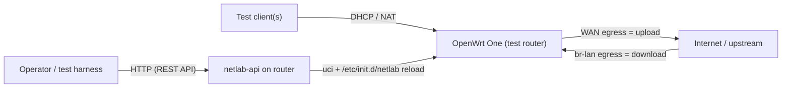
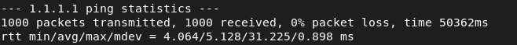
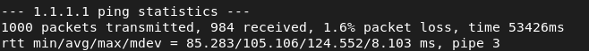

# OpenWrt Network Impairment Test Lab

A reproducible lab for putting devices under **controlled, predictable network
impairment** — latency, jitter, packet loss, and bandwidth limits — using a
dedicated OpenWrt router, plus a REST API to change those conditions on demand
over the network.

Every client downstream of the router's test port gets DHCP, reaches the
internet through NAT, and experiences the currently configured impairment. The
impairment is applied per direction with `tc`/`netem`:

- **upload** = WAN egress (test clients toward the internet)
- **download** = the LAN/test bridge egress (internet toward test clients)

## Repository layout

| Path | What it is |
| --- | --- |
| [`openwrt_basic_setup.md`](openwrt_basic_setup.md) | Step-by-step guide to build the impaired test subnet on an OpenWrt One (packages, LAN/DHCP/firewall, manual `tc`/`netem`, persistence, validation, rollback). |
| [`netlab-api/`](netlab-api/) | Node.js REST API that runs on the router and lets you read/change impairment over HTTP, with an OpenAPI 3.1 spec. |
| [`notes.md`](notes.md) | Workstation-side notes for isolating a test NIC in a Linux network namespace. |
| [`openwrt-captures/`](openwrt-captures/) | Example packet captures with and without impairment. |
| `*-ping-results.png` | Screenshots of ping latency/jitter before and after shaping. |

## How it fits together



The REST API writes validated values into the `netlab` UCI config and reloads
the `netlab` service, which (re)applies the `tc`/`netem` qdiscs. This keeps a
single source of truth and persists settings across reboots and WAN reconnects.

## Getting started

### 1. Build the impaired test subnet

Follow [`openwrt_basic_setup.md`](openwrt_basic_setup.md) to configure the
router: install `tc-full`/scheduler modules, set up the `192.168.50.0/24` test
LAN with DHCP and NAT, and verify manual impairment with `tc`. Confirm a test
client gets an address and reaches the internet before enabling shaping.

### 2. Deploy the REST API (optional but recommended)

The API automates impairment control and also lays down the persistence layer
(`/etc/config/netlab` + `/etc/init.d/netlab`) for you. See
[`netlab-api/docs/deployment.md`](netlab-api/docs/deployment.md):

```sh
scp -r netlab-api root@192.168.50.1:/root/
ssh root@192.168.50.1 'cd /root/netlab-api && sh scripts/install.sh'
curl http://192.168.50.1:8080/healthz     # -> {"status":"ok"}
```

Then drive it over HTTP:

```sh
HOST=http://192.168.50.1:8080

# Apply a preset (see the profiles endpoint for the full list)
curl -X POST $HOST/api/v1/profiles/poor-lte/apply

# Set an explicit asymmetric profile
curl -X PUT $HOST/api/v1/impairment -H 'Content-Type: application/json' -d '{
  "enabled": true, "queueLimit": 1000,
  "upload":   { "rateMbit": 5,  "delayMs": 80, "jitterMs": 25, "lossPct": 2 },
  "download": { "rateMbit": 30, "delayMs": 20, "jitterMs": 5,  "lossPct": 0.2 }
}'

# Remove all impairment
curl -X DELETE $HOST/api/v1/impairment
```

Full API reference: [`netlab-api/docs/api.md`](netlab-api/docs/api.md) (source of
truth: [`netlab-api/openapi.yaml`](netlab-api/openapi.yaml)).

## Example results

Ping from a test client, without and with impairment applied:

| Baseline (no impairment) | Impaired |
| --- | --- |
|  |  |

Corresponding packet captures are in [`openwrt-captures/`](openwrt-captures/).

## Safety and scope

- This is designed for a **dedicated** test router. Every client downstream of
  the test port is impaired together — do not attach production devices.
- The management path may share the impaired network. Keep a serial console
  available and avoid 100% loss / unusably low bandwidth until rollback is
  proven. See the warnings throughout [`openwrt_basic_setup.md`](openwrt_basic_setup.md).
- The REST API ships **without authentication** by design (trusted/isolated WAN
  only). Review the hardening notes in
  [`netlab-api/docs/deployment.md`](netlab-api/docs/deployment.md) before any
  real exposure.
